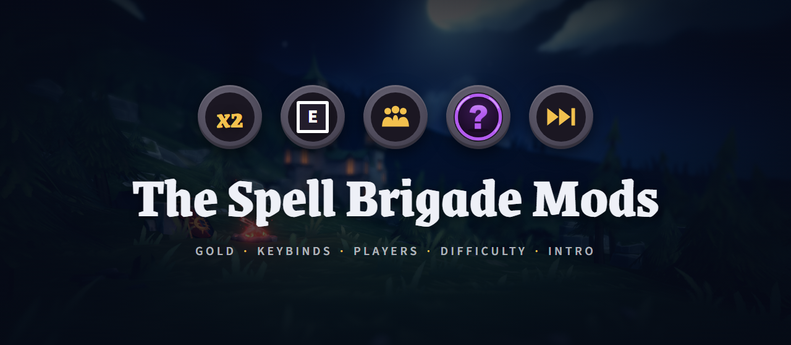
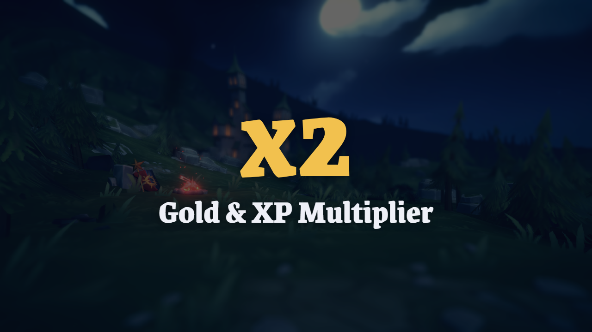
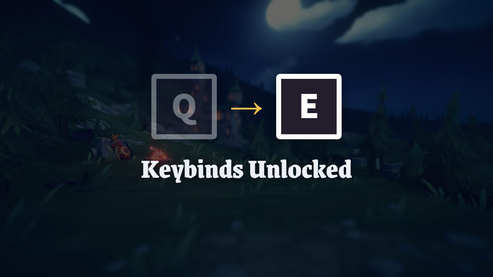
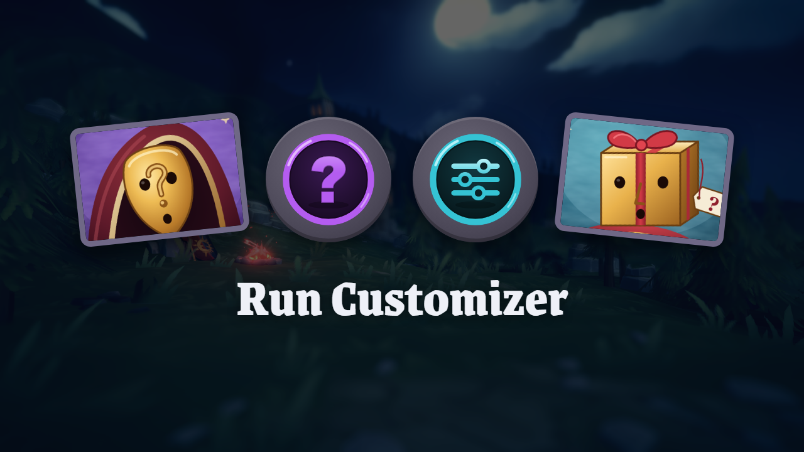
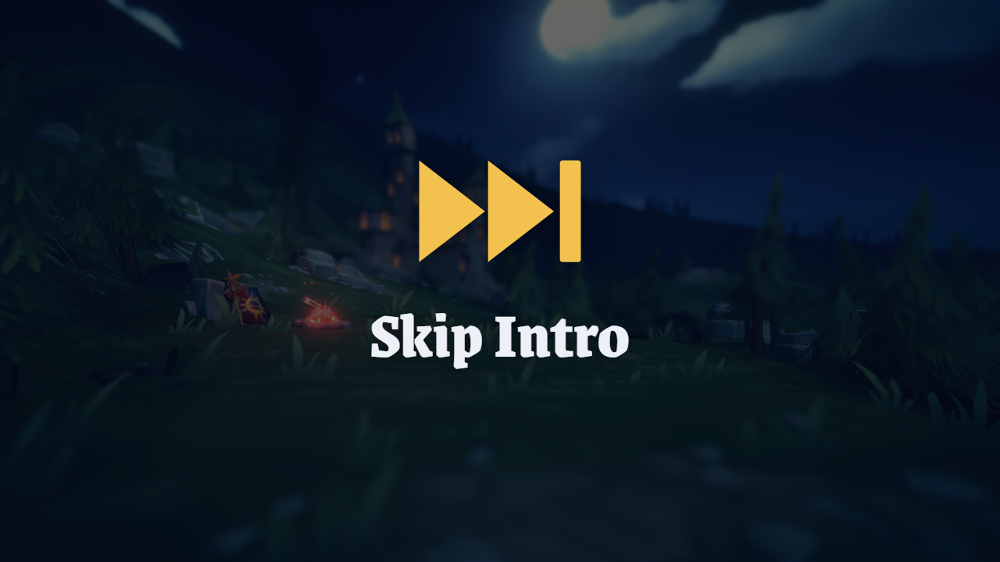

<div align="center">
  

  <h1>SpellBrigade</h1>

  [](https://store.steampowered.com/search/?term=The+Spell+Brigade)
  [](https://github.com/LavaGang/MelonLoader/releases)
  [](https://dotnet.microsoft.com/download/dotnet/6.0)
  [](#-the-mods)
  [](#-languages)

  **🧙 Five MelonLoader mods that make The Spell Brigade play your way — more gold, more players, your keys, your difficulty ✨**

  [The mods](#-the-mods) · [Install](#-install) · [Build from source](#%EF%B8%8F-build-from-source) · [Русский](#-по-русски)
</div>

---

## 💡 Why

**The pain:** The Spell Brigade is a great co-op spell-slinger, but it's locked to 4 players, three fixed difficulties, hard-coded keys and a grind for gold and ranks.

**The fix:** each mod here changes one thing and does it natively. There are no config files to edit and no overlay windows. New buttons, tabs and screens are built from the game's own UI, so they look, sound and navigate like the rest of the game, with mouse, keyboard or gamepad.

<div align="center">

| | |
|---|---|
| 🎮 **Native UI** | New options live inside the game's own menus |
| 🌍 **16 languages** | Follows the game's language and switches on the fly |
| 🧩 **Plays well together** | Install any combination, all five work side by side |
| 🛡️ **Update-safe** | A hook the game changed is skipped with a clear log line, the rest keeps working |

</div>

## 🧩 The mods

<table>
  <tr>
    <td width="50%" valign="top">
      
      <h3>💰 Gold &amp; XP Multiplier <sub>2.5.0</sub></h3>
      <ul>
        <li>Multiplies run gold (base reward and every bonus), run XP and wizard rank XP</li>
        <li>New <b>Options → Multipliers</b> tab, changes apply instantly</li>
        <li>End-of-run reveal: vanilla numbers first, then a big <b>x2</b> slams into the total</li>
        <li>Repairs corrupted wizard ranks from the game's backup saves</li>
      </ul>
    </td>
    <td width="50%" valign="top">
      
      <h3>⌨️ Keybinds Unlocked <sub>1.0.1</sub></h3>
      <ul>
        <li>Real rebinding in <b>Options → Controls</b>: keyboard, mouse and controller</li>
        <li>On-screen key icons follow your new keys, missing icons are drawn in the game's style</li>
        <li>Conflict warnings and one-click reset</li>
        <li>Menu navigation never changes, so you can't lock yourself out</li>
      </ul>
    </td>
  </tr>
  <tr>
    <td width="50%" valign="top">
      
      <h3>🎲 Run Customizer <sub>1.0.0</sub></h3>
      <ul>
        <li><b>Random</b> difficulty: enemy strength, spawn speed, enemy count and health drops each rolled separately, or a random base difficulty</li>
        <li><b>Custom</b> difficulty: set all four yourself</li>
        <li><b>Random Wizard</b> roulette and <b>Surprise Wizard</b>, revealed when the run starts</li>
        <li>Pause and end-of-run screens show what you rolled</li>
      </ul>
    </td>
    <td width="50%" valign="top">
      
      <h3>⏭️ Skip Intro <sub>1.0.0</sub></h3>
      <ul>
        <li>No studio logos, no intro videos: the game opens straight to the menu</li>
        <li>Uses the game's own skip, nothing to configure</li>
        <li>The first-launch consent screen is left alone</li>
      </ul>
    </td>
  </tr>
  <tr>
    <td colspan="2" valign="top">
      <h3>👥 More Players <sub>1.0.0</sub></h3>
      <ul>
        <li>Up to <b>8 players</b> by default, configurable from 4 to 16 (<code>MaxPlayers</code> in <code>MelonPreferences.cfg</code>)</li>
        <li>Lobby split into rooms of 4 seats, the full player list on <b>Tab</b></li>
        <li>Capture-point speed and zone radius keep scaling past 4 players</li>
        <li>⚠️ Every player in the lobby needs the mod</li>
      </ul>
    </td>
  </tr>
</table>

## 🚀 Install

1. Install [MelonLoader](https://github.com/LavaGang/MelonLoader/releases) **0.7.x** for The Spell Brigade and launch the game once.
2. Drop the mods you want into the game's `Mods` folder:

   ```
   <Steam>\steamapps\common\The Spell Brigade\Mods\
   ```

3. Launch the game. Each mod prints a one-line status to `MelonLoader\Latest.log`, so you can check that it loaded.

| Mod | DLL | Where to find it in game |
|---|---|---|
| Gold & XP Multiplier | `GoldXpMultiplier.dll` | Options → Multipliers |
| Keybinds Unlocked | `KeybindsUnlocked.dll` | Options → Controls |
| More Players | `MorePlayers.dll` | Lobby, Tab for the player list |
| Run Customizer | `RunCustomizer.dll` | Threat Level window, wizard list |
| Skip Intro | `SkipIntro.dll` | Game start |

To uninstall a mod, delete its DLL. Settings live in `UserData\MelonPreferences.cfg`, and keybinds in `UserData\KeybindsUnlocked.json`.

### 🤝 Co-op notes

- **More Players**: every player needs it.
- **Run Customizer**: difficulty modes are picked by the host and work on the host's side. The random wizard works for each player who has the mod.
- **Gold & XP Multiplier**: run XP is multiplied when the host has the mod. Gold and rank XP are yours alone.
- **Keybinds Unlocked** and **Skip Intro** are purely local.

## 🛠️ Build from source

You need the [.NET 6 SDK](https://dotnet.microsoft.com/download/dotnet/6.0) and the game with MelonLoader installed and launched once, because the build references the IL2CPP interop assemblies MelonLoader generates.

```bash
dotnet build -c Release SkipIntro/SkipIntro.csproj
```

Every project copies its DLL straight into the game's `Mods` folder after building. Close the game first, or the copy fails because the file is in use.

If the game isn't in the default Steam folder, pass its location:

```bash
dotnet build -c Release RunCustomizer/RunCustomizer.csproj -p:GameRoot="D:\Games\The Spell Brigade"
```

### 📁 Layout

```
SpellBrigade/
├── GoldMultiplier/    Gold & XP Multiplier
├── Keybinds/          Keybinds Unlocked
├── MorePlayers/       More Players
├── RunCustomizer/     Run Customizer (Icons/ are embedded into the DLL)
├── SkipIntro/         Skip Intro
└── */nexus/           Nexus Mods page kit: description, thumbnail, header, release zip
```

### 🔬 Under the hood

The game is IL2CPP, so every hook is a detour on native code, and native code has two traps. The mods guard against both:

- **Identical code folding.** The compiler merges methods that compile to the same machine code, so hooking one would hook thousands. `SharedCodeGuard` checks every target and refuses to patch shared code.
- **Inlining.** A method that was inlined into its callers never runs as itself, so a hook on it never fires. Hooks go on the callers instead.

## 🌍 Languages

English, Русский, Українська, Deutsch, Français, Italiano, Nederlands, Polski, Português (Brasil), Português (Portugal), Español, 日本語, 한국어, 简体中文, 繁體中文, ไทย

Translations are community-grade. Corrections are welcome in [issues](https://github.com/Everelsu/SpellBrigade/issues).

---

<div align="center">

Made by **Relsev** · ⭐ Star the repo if a mod made your runs better

</div>
